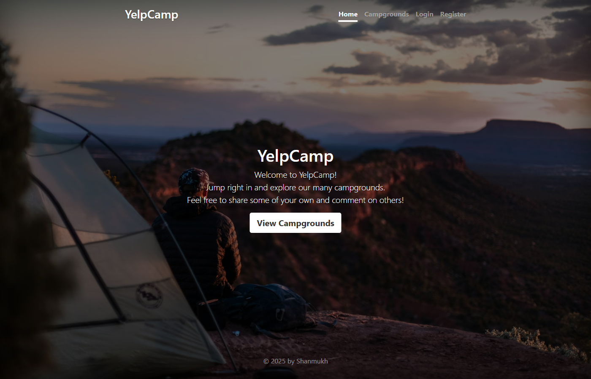
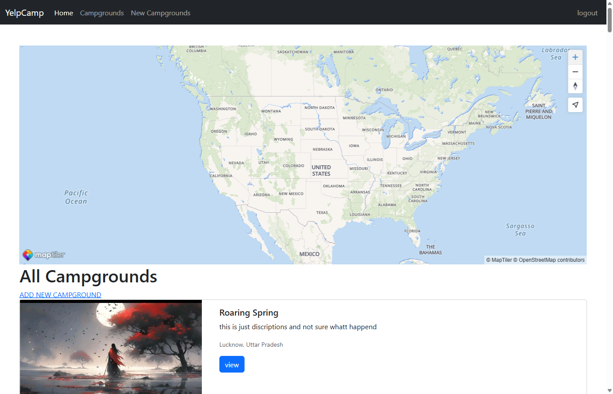
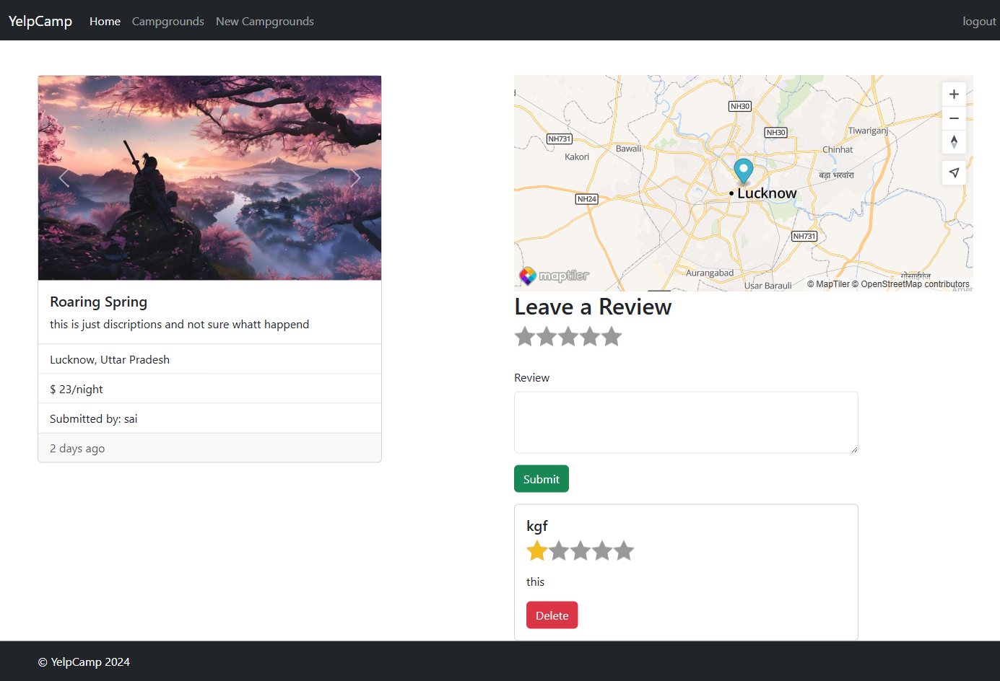
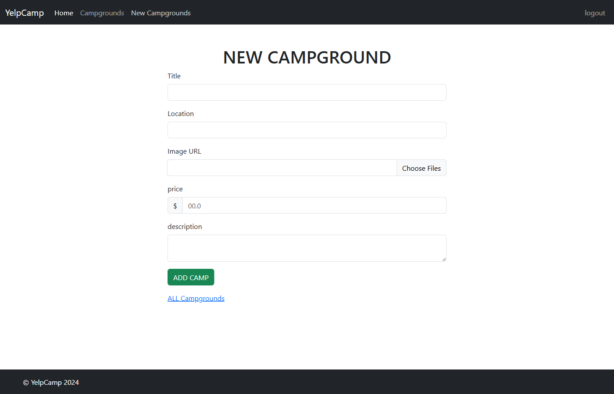
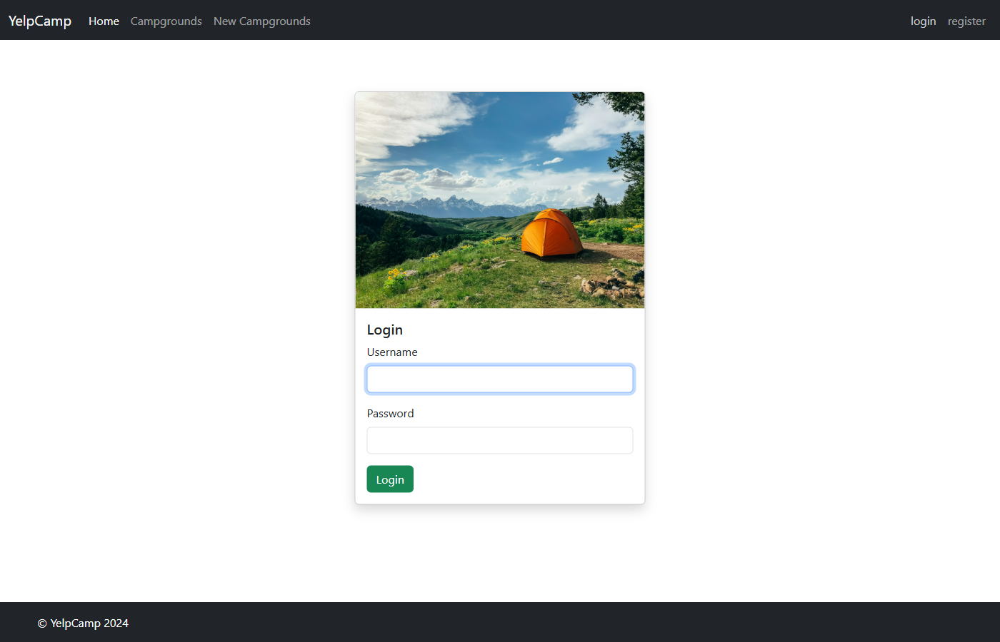
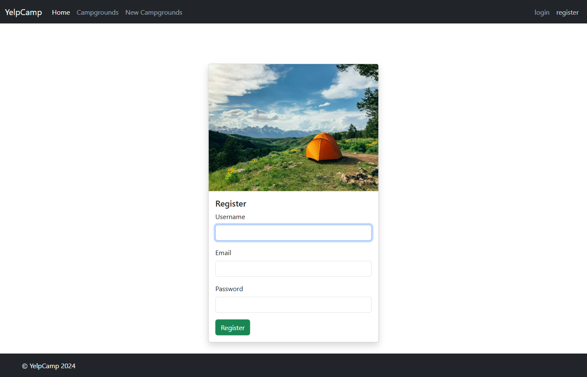
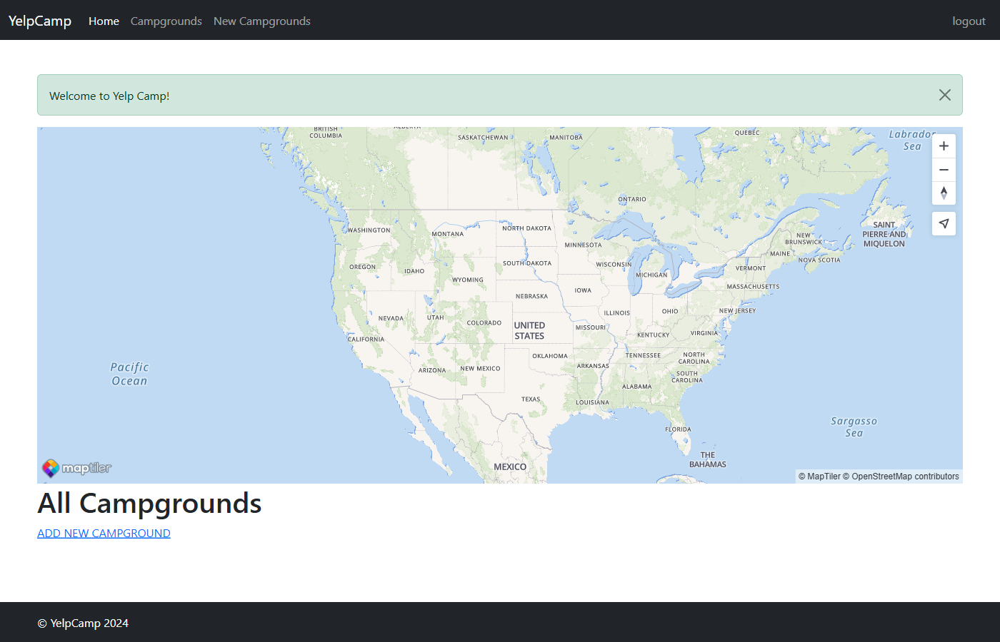

<p align="center">
  
  
  
  
  
  
  
</p>

# ⛺ YelpCamp

A full-stack campground review web application where users can create, review, and explore campgrounds from around the world. Built with Node.js, Express, MongoDB, and featuring interactive cluster maps, image uploads, and user authentication.

> _"Jump right in and explore our many campgrounds. Feel free to share some of your own and comment on others!"_

---

## 🖼️ Screenshots

### 🏠 Landing Page
A beautiful full-screen hero page that welcomes users to YelpCamp.



---

### 🗺️ Campgrounds Index with Cluster Map
Browse all campgrounds with an interactive cluster map powered by MapTiler. Click on clusters to zoom in and discover campgrounds in specific areas.



---

### 📄 Campground Details Page
View campground details including image carousel, description, price per night, location map, and user reviews with star ratings.



---

### ➕ Create New Campground
Authenticated users can add new campgrounds with title, location (auto-geocoded), price, description, and multiple image uploads via Cloudinary.



---

### 🔐 Login Page
Clean card-based login form with form validation.



---

### 📝 Register Page
New users can sign up with a username, email, and password.



---

### 💬 Flash Messages
Success and error flash messages provide feedback for every user action.



---


## ✨ Features

### 🏕️ Campgrounds
- Browse all campgrounds with card-based layout
- Interactive cluster map showing campground locations
- Create, edit, and delete campgrounds (authorization required)
- Multiple image uploads per campground with Cloudinary storage
- Auto-geocoding of locations using MapTiler API
- Image carousel on campground detail pages
- Thumbnail previews for image management

### 👤 User Authentication
- User registration with email, username, and password
- Secure login/logout with Passport.js local strategy
- Session management with MongoDB store
- Protected routes requiring authentication
- "Return to" functionality after login

### ⭐ Reviews
- Star rating system (1–5 stars)
- Leave text reviews on any campground
- Only review authors can delete their reviews
- Reviews displayed with author username

### 🗺️ Maps Integration
- Interactive cluster map on index page
- Individual campground location maps
- Click-to-zoom cluster functionality
- Popup markers with campground previews
- Powered by MapTiler SDK

### 🔒 Security
- Helmet.js for HTTP security headers
- Content Security Policy (CSP) configured
- MongoDB injection sanitization
- HTML sanitization in user inputs (XSS protection)
- Joi schema validation for all inputs

---

## 🛠️ Tech Stack

| Category | Technology |
|----------|------------|
| **Runtime** | Node.js |
| **Framework** | Express.js |
| **Database** | MongoDB with Mongoose ODM |
| **Templating** | EJS with EJS-Mate layouts |
| **Authentication** | Passport.js (Local Strategy) |
| **Image Storage** | Cloudinary |
| **Maps** | MapTiler SDK |
| **Styling** | Bootstrap 5 |
| **Session Store** | connect-mongo |
| **Validation** | Joi |
| **Security** | Helmet, express-mongo-sanitize, sanitize-html |
| **File Uploads** | Multer with Cloudinary storage |

---

## 📁 Project Structure

```
YelpCamp/
├── app.js                 # Main application entry point
├── middleware.js          # Custom middleware (auth, validation)
├── schema.js              # Joi validation schemas
├── package.json
│
├── models/
│   ├── campground.js      # Campground schema with virtuals
│   ├── review.js          # Review schema
│   └── user.js            # User schema with passport-local-mongoose
│
├── routes/
│   ├── campground.js      # Campground CRUD routes
│   ├── review.js          # Review routes
│   └── user.js            # Auth routes (register, login, logout)
│
├── controllers/
│   ├── campgrounds.js     # Campground controller logic
│   ├── reviews.js         # Review controller logic
│   └── users.js           # User controller logic
│
├── views/
│   ├── home.ejs           # Landing page
│   ├── error.ejs          # Error page
│   ├── layouts/           # EJS-Mate layout templates
│   ├── partials/          # Navbar, footer, flash messages
│   ├── campground/        # Index, show, new, edit views
│   └── user/              # Login, register views
│
├── public/
│   ├── javascripts/       # Client-side JS (maps, validation)
│   └── stylesheets/       # Custom CSS
│
├── cloudinary/
│   └── index.js           # Cloudinary configuration
│
├── utils/
│   ├── catchAsync.js      # Async error wrapper
│   └── ExpressError.js    # Custom error class
│
└── seeds/
    ├── index.js           # Database seeder
    ├── cities.js          # City data
    └── seedHelpers.js     # Random name generators
```

---

## 🚀 Getting Started

### Prerequisites
- Node.js (v14+)
- MongoDB (local or Atlas)
- Cloudinary account
- MapTiler account

### Installation

1. **Clone the repository**
   ```bash
   git clone https://github.com/yourusername/yelpcamp.git
   cd yelpcamp
   ```

2. **Install dependencies**
   ```bash
   npm install
   ```

3. **Create a `.env` file** in the root directory:
   ```env
   DB_URL=mongodb://localhost:27017/yelp-camp
   # Or your MongoDB Atlas connection string
   
   CLOUDINARY_CLOUD_NAME=your_cloud_name
   CLOUDINARY_KEY=your_api_key
   CLOUDINARY_SECRET=your_api_secret
   
   MAPTILER_API_KEY=your_maptiler_key
   
   SESSION_SECRET=your_session_secret
   ```

4. **Seed the database** (optional)
   ```bash
   node seeds/index.js
   ```

5. **Start the server**
   ```bash
   node app.js
   ```

6. **Open your browser**
   ```
   http://localhost:3000
   ```

---

## 🔑 Environment Variables

| Variable | Description |
|----------|-------------|
| `DB_URL` | MongoDB connection string |
| `CLOUDINARY_CLOUD_NAME` | Cloudinary cloud name |
| `CLOUDINARY_KEY` | Cloudinary API key |
| `CLOUDINARY_SECRET` | Cloudinary API secret |
| `MAPTILER_API_KEY` | MapTiler API key for maps |
| `SESSION_SECRET` | Secret for session encryption |

---

## 📡 API Routes

### Campgrounds
| Method | Route | Description | Auth Required |
|--------|-------|-------------|---------------|
| GET | `/campgrounds` | List all campgrounds | No |
| GET | `/campgrounds/new` | New campground form | Yes |
| POST | `/campgrounds` | Create campground | Yes |
| GET | `/campgrounds/:id` | Show campground | No |
| GET | `/campgrounds/:id/edit` | Edit form | Yes (Author) |
| PUT | `/campgrounds/:id` | Update campground | Yes (Author) |
| DELETE | `/campgrounds/:id` | Delete campground | Yes (Author) |

### Reviews
| Method | Route | Description | Auth Required |
|--------|-------|-------------|---------------|
| POST | `/campgrounds/:id/reviews` | Create review | Yes |
| DELETE | `/campgrounds/:id/reviews/:reviewId` | Delete review | Yes (Author) |

### Users
| Method | Route | Description |
|--------|-------|-------------|
| GET | `/register` | Registration form |
| POST | `/register` | Create user |
| GET | `/login` | Login form |
| POST | `/login` | Authenticate user |
| GET | `/logout` | Logout user |

---

## 🙏 Acknowledgments

- [Colt Steele's Web Developer Bootcamp](https://www.udemy.com/course/the-web-developer-bootcamp/) — Original course inspiration
- [Unsplash](https://unsplash.com/) — Beautiful campground images
- [MapTiler](https://www.maptiler.com/) — Map services
- [Cloudinary](https://cloudinary.com/) — Image hosting
- [Starability](https://github.com/LunarLogic/starability) — Star rating CSS

---

## 📄 License

This project is open source and available under the [MIT License](LICENSE).

---

<p align="center">
  Made with ❤️ by Shanmukh
</p>
